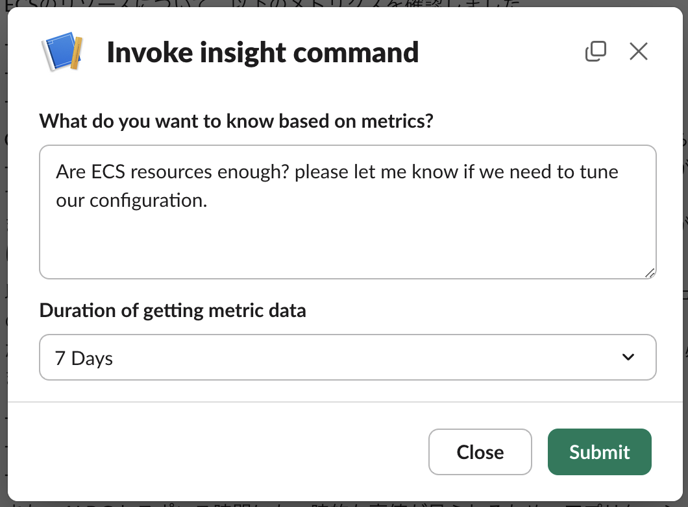
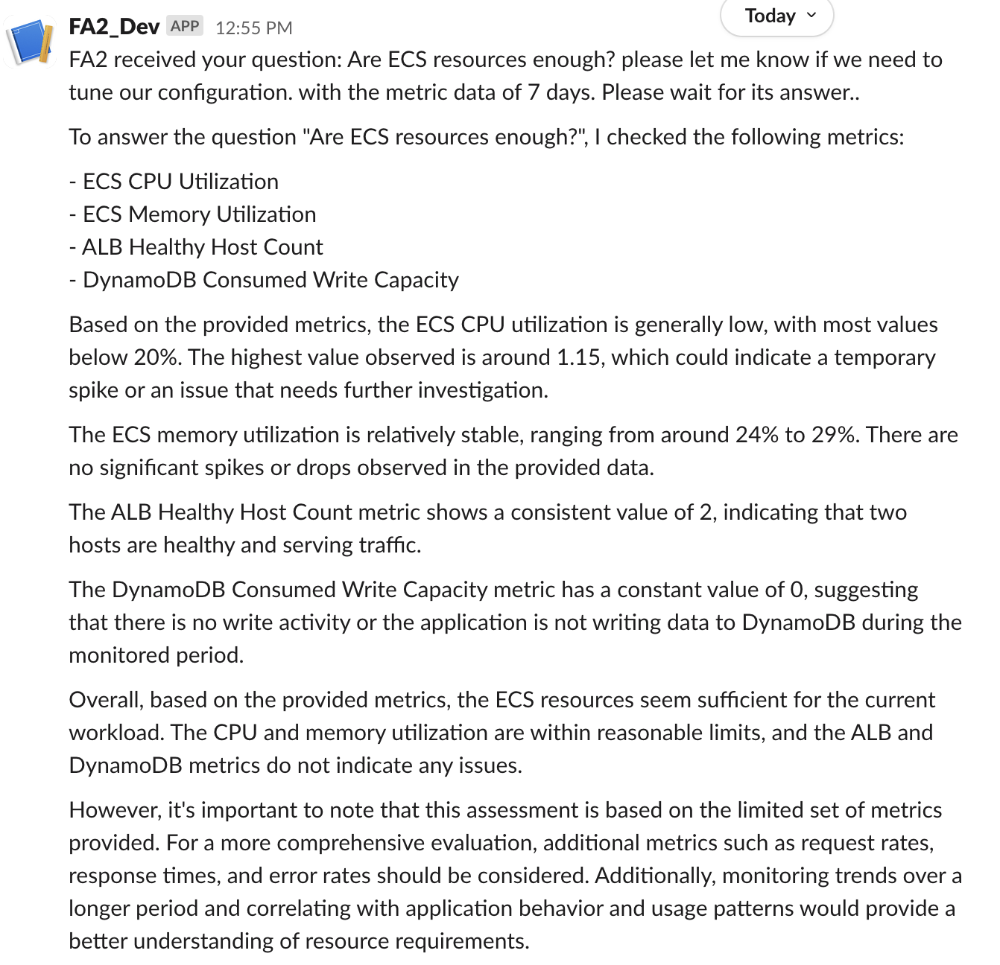
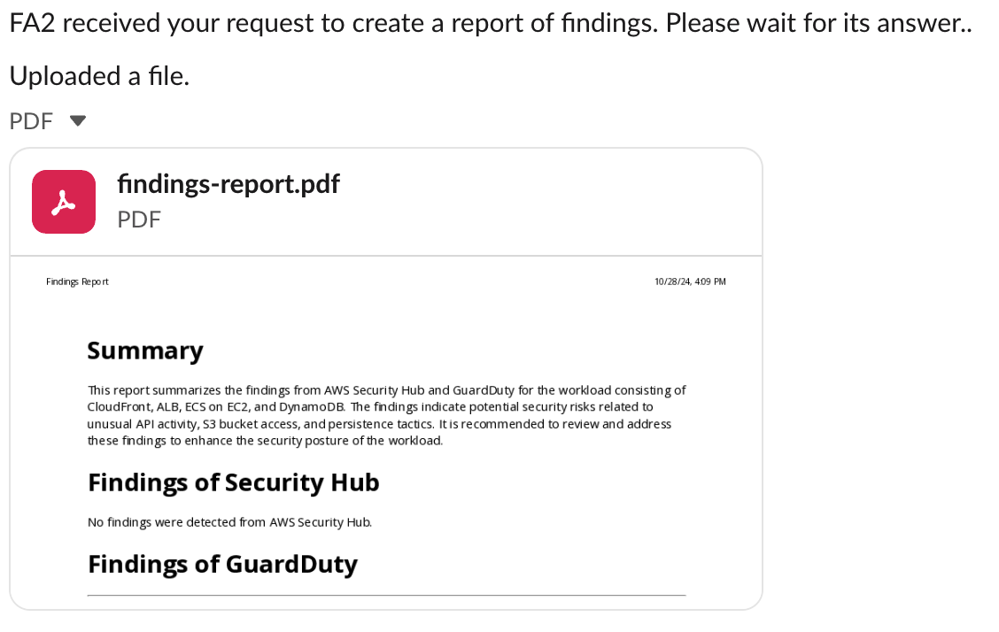

# Failure Analysis Assistant (FA2) Slack App Version

[日本語で読む](./README.md)

This is a sample implementation that responds to alarms sent to Slack by AWS Chatbot and helps analyze the root cause of the failure.
This is the sample code for the demo shown at the AWS Summit Japan 2024 booth.
This sample code provide two features as below,

**Failure analysis assist**

Logs are retrieved from a predefined log storage location within a time range specified by the user, information is extracted and summarized with LLM, and information useful for failure analysis is returned to Slack.
For an example of how the function works, see [Failure Analysis Assist](#failure-analysis-assist).

**Metrics analysis support**

In response to questions given by users, a function has been added to select metrics that require generative AI and answer questions based on that metric data.
For example of the operation of the function, see [[Optional]Metric Analysis Assist](#optionalmetrics-analysis-assist).
**This feature is optional.** If you want to use it, please see [Setting parameters](#setting-parameters) and [[Optional]Configuration of Slack App for Metrics Insight Assist](#optionalconfiguration-of-slack-app-for-metrics-insight-assist).

**Findings Report**

We've added the feature to create a report explaining Security Hub and GuardDuty Findings by LLM.
For example of the function in action, see [[OPTIONAL]Findings Report](#optionalfindings-report).
**This feature is optional**, so if you want to enable it, check [Setting parameters](#setting-parameters) and [[Optional]Configuration of Slack App for Findings Report](#optionalconfiguration-of-slack-app-for-findings-report).

## Branches

- [`main`](https://github.com/aws-samples/failure-analysis-assistant) - This branch. This version uses the Slack App. This was exhibited at the AWS Summit Japan 2024.
- [`chatbot-customaction`](https://github.com/aws-samples/failure-analysis-assistant/tree/chatbot-customaction) - Instead of the Slack App, this is a version that implements an input form using a `Custom Action` of AWS Chatbot. If you don't have an environment where you can't use the Slack App, or if you don't want to manage the Slack App, use this.

## Background

I think there are many people who have implemented ChatOps to send alarm notifications to the chat applications.
However, when an event such as an alarm occurs, what actually takes time is root cause analysis and correction after identification of analysis results, which occurs after the event is detected.
This sample shows failure analysis using LLM as one idea to make cause analysis as efficient as possible.

Normally, when you analyses root cause, you aquired logs after defining a fixed period of time from the time the alarm occurred using empirical rules.
The logs are not in one place, and there are in many places. After collecting logs from all places, we organize their dependencies, and identify the root cause.

This process is so hard task that requires patience and time, and pressure will be applied in situations in the case of happening the negative impact to your business.
Amazon CloudWatch Logs, which is a typical log output location for AWS, has an API for querying, so if you have specific time range, you can retrieve logs. we can retrieve the logs from Amazon S3 that is combined with Amazon Athena in similar way.
Additionally, by specifying a time range, AWS X-Ray can also obtain trace information for that time range.

From the above, it is possible to automate the retrieval of logs and traces programmatically.
And, we inputted the acquired information into a large language model (LLM) to improve the efficiency of information extraction and summarization.

LLM is known for its ability to handle summaries and information extraction. It is possible to process more input information in a faster time than humans.
There is a possibility that hallucination will be included in LLM response, so caution is necessary, but I think it can be used as an auxiliary way for humans to make decisions in the end.

Please use this sample and try out the effects.

## Architecture & Workflow

The scope of existing workloads is based on the assumption that you have already been implemented.
You can try this sample if the log is output to CloudWatch Logs. S3 and X-Ray are optional.


1. Alarms are triggered on the target system, and notifications are sent to Slack via Amazon SNS and AWS Chatbot
2. Show the input form of Slack App when it received an alarm.
3. Enter `log retrieval time range` and `event information understood from alarms`, and submit a request
4. FA2 runs on AWS Lambda and accesses you defined log search targets and collects information from the log retrieval time range included in the request
   1. The parameters you set determine what to search for. A log group of Amazon CloudWatch Logs is required; database of Amazon Athena, and the parameter of AWS X-Ray are optional
   2. By increasing the number of search targets, there is a possibility that more accurate answers can be obtained
5. The collected information is added as context to the prompt template included in FA2 and sent to Amazon Bedrock to summarize information related to the event and extract information necessary for event cause analysis
6. Send the answers obtained from LLM to Slack.

## Requirements

- You can use the AWS Cloud Development Kit (CDK)
  - This sample is implemented in CDK
- You must have a CloudWatch Logs log group containing the logs you want to analyze
  - Amazon Athena and AWS X-Ray are optional
  - If you want to invlude AWS CloudTrail or Application Load Balancer (ALB) access logs, an Amazon Athena database must be created
  - If AWS X-Ray trace information is also used, an AWS X-Ray trace for the relevant system must have been obtained
- Claude 3 Sonnet and Claude 3.5 Sonnet access has been granted from model access on Amazon Bedrock
  - Claude 3.5 Sonnet is used for generation of the image written by Mermaid syntax.
- Confirm that an alarm notification will be sent to Slack from the AWS Chatbot set up in the existing workload
  - If you don't have the test envrionment for FA2 or you cannot use it for FA2. You can create test environment as follow [How to create a test environment for FA2](./docs/HowToCreateTestEnvironment_en.md).
- You must have the permission to register the Slack App to the Slack workspace you want to use.
- Turn on execution logging and access logging.
  - If you didn't turn on, please turn on this setting as follow: [Create an IAM role to log to CloudWatch] and [Add the IAM role in the API Gateway console] in [How do I turn on CloudWatch Logs for troubleshooting my API Gateway REST API or WebSocket API?](https://repost.aws/knowledge-center/api-gateway-cloudwatch-logs)

## How to Deploy

### Registration of Slack App

1. Access to [Slack api](https://api.slack.com/apps) and click [create New App]
2. Select [From scratch], enter an app name, select the workspace you want to use when developing, and then click [Create App]
3. The app you created will be shown in [Slack api](https://api.slack.com/apps). Choose it you created.
4. Click [Basic Information] on the left menu, check [Signing Secret], execute the following command, and register with AWS Secrets Manager
   1. `$ aws secretsmanager create-secret --name slackSigningSecret --secret-string XXXXXXXXXXXXXXXXXXXX --profile {your_profile} `
5. Click [OAuth & Permissions] on the left menu, please add permissons `channels:read`, `chat:write` and `files:write` in [Scopes] section.
6. Click [Install to Workspace] in [OAuth Tokens for Your Workspace] of top of same page to install your Slack App to your workspace.
7. After installing, your browser will be redirected to [OAuth & Permissions] page. You check [Bot User OAuth Token], execute the following command, and register with AWS Secrets Manager
   1. `$ aws secretsmanager create-secret --name slackAppToken --secret-string xxxx-111111111111111-11111111111111111-xxxxxxxxxxxxxxxxxxxxxxxxx-profile {your_profile} `

### Setting parameters

Refer to the following description, copy `parameter_template.ts`, create `parameter.ts`, and then change each value.

```
// Example: Settings for the Slack App version when using Claude 3 Sonnet and using CloudWatch Logs, Athena, and X-Ray as search targets
export const devParameter: AppParameter = {
  env: {
    account: "123456789012",
    region: "us-east-1",
  },
  language: "ja",
  envName: "Development",
  modelId: "anthropic.claude-3-sonnet-20240229-v1:0",
  slackAppTokenKey: "SlackAppToken",
  slackSigningSecretKey: "SlackSigningSecretKey",
  architectureDescription: "The workload you are responsible for consists of CloudFront, ALB, ECS on EC2, and DynamoDB, and Spring applications are deployed on ECS on EC2."
  cwLogsLogGroups: [
    "ApiLogGroup", "/aws/ecs/containerinsights/EcsAppCluster/performance"
  ],
  cwLogsInsightQuery: "fields @message | limit 100",
  databaseName: "athenadatacatalog",
  albAccessLogTableName: "alb_access_logs",
  cloudTrailLogTableName: "cloud_trail_logs",
  xrayTrace: true,
  slackCommands: {
    insight: true,
    findingsReport: true,
  },
  detectorId: "xxxxxxxxxxxxxxx"
};
```

#### Explanation of parameters

| Parameters               | Example value                                                             | Description                                                                                                                                                                                 |
| ------------------------ | ------------------------------------------------------------------------- | ------------------------------------------------------------------------------------------------------------------------------------------------------------------------------------------- |
| `env.account`            | `"123456789012"`                                                          | AWS Account ID to deploy this sample                                                                                                                                                        |
| `env.region`             | `"us-east-1"`                                                             | AWS Region to deploy this sample                                                                                                                                                            |
| `language`               | `"ja"`                                                                    | Language setting for prompt and UI. Choose one, `en` or `ja`.                                                                                                                               |
| `envName`                | `"Development"`                                                           | Environment name.                                                                                                                                                                           |
| `modelId`                | `"anthropic.claude-3-sonnet-20240229-v1:0"`                               | Put the model ID of Amazon Bedrock you want to use. Please check access grants of chosen model.                                                                                             |
| `slackAppTokenKey`       | `"SlackAppToken"`                                                         | The key name is to get `SlackAppToken` from AWS Secrets Manager. You should use the same key name in [Registration of Slack App](#registration-of-slack-app).                               |
| `slackSingingSecretKey`  | `"SlackSigingSecret"`                                                     | The key name is to get `SlackSigningSecret` from AWS Secrets Manager. You should use the same key name in [Registration of Slack App](#registration-of-slack-app).                          |
| `architectureDescription`  | `"The workload you are responsible for consists of CloudFront, ALB, ECS on EC2, and DynamoDB, and Spring applications are deployed on ECS on EC2."`                                                     | This is a sentence explaining the system to failure analysis. It will be incorporated into the prompt, so please try to include AWS service names and element technology, and keep it simple.                           |
| `cwLogsLogGroups`        | `["ApiLogGroup", "/aws/ecs/containerinsights/EcsAppCluster/performance"]` | Specify the log group of Amazon CloudWatch Logs for which you want to retrieve logs. Up to 50 can be specified.                                                                             |
| `cwLogsInsightQuery`     | `"fields @message \| limit 100"`                                          | Specify the query you want to use with CloudWatch Logs Insight. Due to balance with the context window, the default limit is 100 (please modify the query according to actual environment). |
| `databaseName`           | `"athenadatacatalog"`                                                     | The name of the Amazon Athena database. Required if you want to use Athena to search logs.                                                                                                  |
| `albAccessLogTableName`  | `"alb_access_logs"`                                                       | ALB access log table name. In this sample, ALB access log search was implemented in Athena, so the ALB access log table name is specified when using it.                                    |
| `cloudTrailLogTableName` | `"cloud_trail_logs"`                                                      | AWS CloudTrail log table name. In this sample, we implemented a CloudTrail audit log log search in Athena, so specify the CloudTrail log table name when using it.                          |
| `xrayTrace`              | `true`                                                                    | A parameter for deciding whether to include AWS X-Ray trace information in the analysis                                                                                                     |
| `slackCommands`              | `{"insight": true, "findingsReport": true}`                                                                    | Decide whether to enable deployment of resources associated with the `insight` and `findings-report` command                                                                                                     |
| `detectorId`              | `"xxxxxxxxxxx"`                                                                    | It is requred if you want to use `findings-report` command. Please input `detectorId` that is defined in your account                                                                                                      |

#### Modify prompts

Prompts used for each inference are described in `lambda/lib/prompts.ts`.
Each prompt uses `architectureDescription` in `parameter.ts` to obtain a description of the target workload's architecture.
Please change the description of this architecture according to the environment in which you are deploying FA2.

Also, if post-deployment testing does not produce the expected results, tune the prompts described in the `createFailureAnalysisPrompt` function.

### Deployment

First, a Lambda function layer is required for the function of illustrating the hypothesis of the cause of failure.
So, first run the command to install the modules required for Layer.
Next, execute the normal CDK deployment command.

```
$ npm run build:layer // This must be done for the function of illustrating hypotheses about the architecture of the system you are responsible for.
$ npm install
$ npx cdk bootstrap --profile {your_profile}
$ npx cdk deploy --all --profile {your_profile} --require-approval never
```

> [!NOTE]
> The part that begins with the description of `// Additional process` in `failure-analysis-assistant/lambda/functions/fa2-lambda/main.mts` that is the process of generating a hypothetical diagram of the cause of the fault.
> If you don't need to generate a diagram, comment out or delete this part.

#### Configuration of Slack App

1. After deploying the CDK, check the Amazon API Gateway endpoint URL
2. Access to [Slack api](https://api.slack.com/apps), select [Interactivity & Shortcuts] on the left menu of the displayed screen, set [Interactivity] to turn on, and enter the endpoint of Amazon API Gateway in [Request URL](example: https://{API Gateway endpoint}/v1/slack/events)
   1. If the API resource name hasn't changed, it will be /slack/events, as shown in the example
3. Next, click [Event Subscriptions] on the left menu, set [Enable Events] to turn on, then set [Reqeust URL] in the same way as [Interactivity]
4. Open [Subscribe to bot events] on the same screen, click [Add Bot User Event] and add `message.channels`, click [Save Changes]
5. Once you've made it this far, a pop-up prompting you to reinstall will appear at the top of the screen, click on it and reinstall the Slack App on the target channel. Because you modified the permission of Slack App token in step 4.
   1. Or open [OAuth & Permissions], and click [Reinstall to {your workspace name}] to re-install your app.
6. Join the Slack App to the target channel. To add, open the desired channel and click on the channel name. Select [Integrations] and then click [Add an app]. Find FA2 (or the name of the app you have registered) and click the [Add] button. Follow the instructions that appear to install the app.

#### [Optional]Configuration of Slack App for Metrics Insight Assist

1. Click [Slash Commands] on the left menu, then click [Create New Command]
   1. Enter the values as shown in the table below, and then click Save when you have entered them all

      | item name         | value                         |
      | ----------------- | ----------------------------- |
      | Command           | /insight                      |
      | Request URL       | same URL                      |
      | Short Description | Get insight for your workload |

2. Click [App Home] on the left menu, check [Allow users to send Slash commands and messages from the messages tab] in [Message tab].

#### [Optional]Configuration of Slack App for Findings Report

1. Click [Slash Commands] on the left menu, then click [Create New Command]
   1. Enter the values as shown in the table below, and then click Save when you have entered them all

      | item name            | value                            |
      | ----------------- | ----------------------------- |
      | Command           | /findings-report                      |
      | Request URL       | same URL         |
      | Short Description | Create report about findings of Security Hub and GuardDuty |

2. Click [App Home] on the left menu, check [Allow users to send Slash commands and messages from the messages tab] in [Message tab].
   1. If you enabled Metrics Insight Assist, you don't need to do that.

### Testing

#### Failure Analysis Assist

Some kind of error occurred on the target system from which the log was output.
(This time, we used AWS FIS and caused a connection failure from the Amazon ECS container to Amazon DynamoDB.)
Then, the following alarm is displayed on the Slack channel.
(In the example, Amazon CloudWatch Synthetics is used to perform external monitoring, so this error occurs.)


When a notification of the alarm is received, FA2 responds and displays a form like the one below


The alarm displayed earlier is confirmed, and the contents of the alarm and the time range for which the log is to be acquired are inputted to the displayed form.

\*The datapoints shown by AWS Chatbot are expressed in GMT, so please enter the form after converting it to your local time zone.


Clicked the button, requests are accepted.


Wait a few minutes, and the answers will appear in Slack.


#### [Optional]Metrics Analysis Assist

You type `/insight` in the Slack chat form and send, a modal will be displayed.
In the modal form, enter [the question you want answered based on the metrics] and [the period you want to obtain the metrics].
In about 1-2 minutes, you'll get an answer.
The metric `Period` is calculated by `3600 + floor(number of days acquired / 5) * 3600`.
If you want to change the expression, see `createSelectMetricsForInsightPrompt()` in `lambda/lib/prompts.ts`.

The following example asks questions about ECS performance.





#### [Optional]Findings Report

You type `/findings-report` in the Slack chat section and send it, a message indicating that the request has been accepted will be displayed.
In about 1-2 minutes, a PDF of the Findings report will be uploaded.



The findings are gotten from `listGuardDutyFindings()` and `listSecurityHubFindings()` functions in `lambda/lib/aws-modules.ts`.
Please modify these functions if you want to change the scope of these findings.

## Delete deployed resources

Please use below command to delete the resources you deployed

```
$ npx cdk destroy --profile {your_profile}
```

## Considerations

Since this source code is a sample, AWS WAF is not attached to the Amazon API Gateway.
Slack's endpoints are publicly exposed, so they can be targeted by attacks.
For production use, please consider using AWS WAF to reduce security risks.

## Security

See [CONTRIBUTING](CONTRIBUTING.md#security-issue-notifications) for more information.

## License

This library is licensed under the MIT-0 License. See the LICENSE file.
